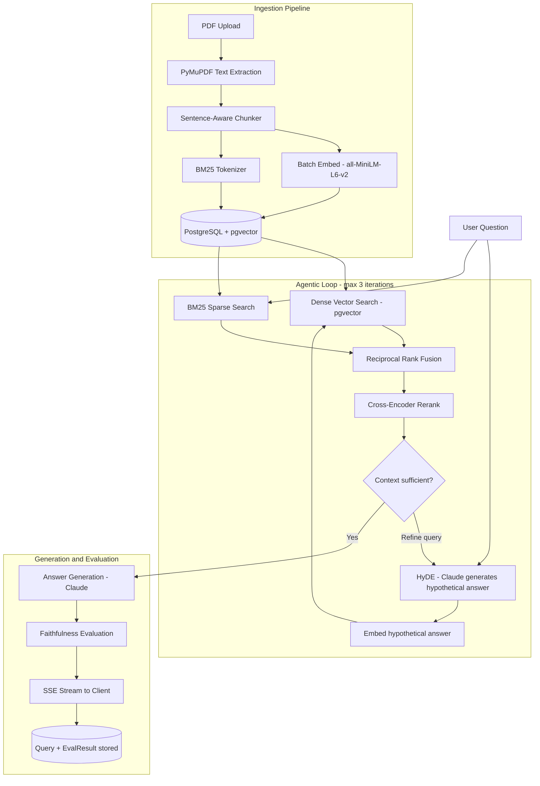

# Scholarly — Academic RAG Pipeline

A Retrieval-Augmented Generation system for querying academic PDFs. Built without LangChain or LlamaIndex — retrieval, BM25, hybrid ranking, and evaluation are all implemented directly.

Users upload PDFs, ask natural language questions, and receive cited answers streamed via SSE. Each answer includes inline citations and a per-claim faithfulness score.

---

## Overview

1. **Ingest** — Upload a PDF. Text is extracted with PyMuPDF, split into sentence-aware overlapping chunks, embedded with `all-MiniLM-L6-v2`, and stored in PostgreSQL with pgvector. Ingestion runs in a background task; the client polls a job ID for status.

2. **Query** — A question goes through the retrieval pipeline (described below), and the answer is streamed token-by-token via SSE with inline citations (`[Title, chunk N]`) and a faithfulness score.

3. **Evaluate** — After each answer is generated, Claude checks each claim sentence against the retrieved context and returns a per-claim grounded/hallucinated breakdown with a 0–1 score.

---

## Retrieval Pipeline

The query pipeline runs inside an **agentic loop** (up to 3 iterations). On each iteration:

```
User Question
     │
     ▼
┌─────────────────────────────────────────────────────┐
│                  Agentic Query Loop                  │
│  ┌──────────────────────────────────────────────┐   │
│  │  1. HyDE: Claude generates hypothetical ans  │   │
│  │  2. Embed hypothetical answer                │   │
│  │  3. Dense vector search (pgvector <=>)       │   │
│  │  4. BM25 sparse search (from scratch)        │   │
│  │  5. Reciprocal Rank Fusion merge             │   │
│  │  6. Cross-encoder rerank top candidates      │   │
│  └──────────────────────────────────────────────┘   │
│  Claude checks sufficiency → REFINE? → loop (max 3) │
└─────────────────────────────────────────────────────┘
     │
     ▼
Answer Generation (Claude claude-sonnet-4-20250514)
     │
     ▼
Faithfulness Evaluation (per-claim)
     │
     ▼
SSE Stream to Client
```

| Stage | Notes |
|---|---|
| HyDE | Embeds a hypothetical answer rather than the raw question, which tends to improve dense retrieval for short or ambiguous queries |
| Dense + BM25 | Dense search covers semantic similarity; BM25 covers exact keyword matches that embeddings can miss |
| RRF | Merges the two ranked lists without requiring score normalization |
| Cross-encoder rerank | Scores query–chunk pairs with full attention; more accurate than bi-encoder similarity at the cost of latency |
| Agentic loop | If Claude judges the retrieved context insufficient, it reformulates the query and retrieves again (up to 3 iterations) |

---

## System Architecture



---

## Feature Summary

| Feature | Implementation |
|---|---|
| PDF Ingestion | PyMuPDF text extraction, sentence-aware chunking with overlap |
| Duplicate Detection | SHA-256 content hash on documents — re-uploading the same PDF is a no-op |
| Dense Retrieval | pgvector cosine similarity search via raw SQL |
| Sparse Retrieval | BM25 implemented from scratch (term frequency, IDF, length normalization) |
| Hybrid Retrieval | Reciprocal Rank Fusion merging dense + sparse ranked lists |
| HyDE | Claude generates a hypothetical answer, embeds it, uses that for vector search |
| Cross-Encoder Reranking | `cross-encoder/ms-marco-MiniLM-L-6-v2` reranks RRF candidates |
| Agentic Loop | Iterative retrieval — Claude decides if context is sufficient, refines query up to N times |
| Answer Generation | Claude with inline citations `[Title, chunk N]` |
| SSE Streaming | `StreamingResponse(text/event-stream)` — streams tokens + citations + metadata |
| Background Ingestion | `BackgroundTasks` — `/ingest` returns `{job_id}` immediately, poll for status |
| Persistent Job Tracking | Ingestion jobs stored in DB — survive API restarts |
| Faithfulness Evaluation | One Claude API call per claim sentence — scores grounded vs. hallucinated claims |
| API Key Auth | `X-API-Key` header dependency — no-op in dev mode, enforced in production |
| Rate Limiting | Sliding-window in-memory rate limiter (per IP, configurable RPM) |
| Structured Logging | JSON log lines with `timestamp`, `level`, `request_id`, `latency_ms` on every request |
| Request ID Middleware | UUID attached to every request/response — all logs for a request share one ID |
| IVFFlat Index Tuning | Migration computes optimal `lists = floor(sqrt(n_chunks))` at deploy time |

---

## BM25 Implementation

Implemented from scratch in `app/retrieval/bm25.py`:

```
score(D, Q) = Σ IDF(qi) * f(qi,D) * (k1 + 1)
                        / (f(qi,D) + k1 * (1 - b + b * |D| / avgdl))

IDF(qi) = log((N - df(qi) + 0.5) / (df(qi) + 0.5) + 1)

k1 = 1.5, b = 0.75
```

The index is built in-memory at query time from tokenized chunk data stored in a `JSONB` column — no external search engine required.

---

## Tech Stack

- **Backend:** Python 3.13, FastAPI, Uvicorn
- **Database:** PostgreSQL 16 + pgvector extension
- **ORM / Migrations:** SQLAlchemy (async), Alembic
- **Embeddings:** `sentence-transformers` — `all-MiniLM-L6-v2` (384 dimensions)
- **Reranker:** `cross-encoder/ms-marco-MiniLM-L-6-v2`
- **LLM:** Anthropic Claude API (`claude-sonnet-4-20250514`)
- **PDF Parsing:** PyMuPDF (fitz)
- **Containerization:** Docker + Docker Compose

---

## Project Structure

```
scholarly/
├── docker-compose.yml
├── Dockerfile
├── alembic.ini
├── requirements.txt
├── .env.example
│
├── app/
│   ├── main.py                        # FastAPI app factory, router registration, model warmup
│   ├── config.py                      # Pydantic BaseSettings — loads from .env
│   ├── database.py                    # Async SQLAlchemy engine + session factory
│   ├── models.py                      # ORM models + in-memory IngestionJob store
│   ├── auth.py                        # X-API-Key header dependency
│   ├── rate_limit.py                  # Sliding-window per-IP rate limiter
│   ├── middleware.py                  # RequestIDMiddleware — UUID per request, latency logging
│   ├── logging_config.py              # Structured JSON logging, safe extra-field handling
│   │
│   ├── ingestion/
│   │   ├── parser.py                  # PDF text extraction via PyMuPDF
│   │   ├── chunker.py                 # Fixed-size chunking with sentence-boundary snapping
│   │   └── pipeline.py               # Orchestrates: parse → chunk → embed → store
│   │
│   ├── retrieval/
│   │   ├── embedder.py                # SentenceTransformer singleton, unit-normalized embeddings
│   │   ├── vector_search.py           # pgvector <=> cosine similarity, raw SQL
│   │   ├── bm25.py                    # BM25 from scratch: BM25Index class + bm25_search()
│   │   ├── reranker.py                # CrossEncoder singleton, rerank() function
│   │   └── hybrid.py                  # HyDE → dense → BM25 → RRF → cross-encoder
│   │
│   ├── generation/
│   │   ├── prompt.py                  # System prompt, context block builder, sufficiency prompt
│   │   └── generator.py              # Claude API: generate_answer() + stream_answer() SSE
│   │
│   ├── agentic/
│   │   └── query_loop.py             # While loop with REFINE: detection, chunk deduplication
│   │
│   ├── evaluation/
│   │   ├── faithfulness.py           # Per-claim Claude verification, faithfulness score
│   │   ├── retrieval_quality.py      # Precision / recall / F1 metrics
│   │   └── runner.py                 # Runs eval and persists EvalResult to DB
│   │
│   └── routes/
│       ├── ingest.py                  # POST /ingest, GET /ingest/{job_id}
│       ├── query.py                   # POST /query — SSE streaming response
│       ├── documents.py               # GET /documents
│       └── eval.py                    # GET /eval?query_id=...
│
├── migrations/
│   ├── env.py                         # Alembic async migration runner
│   └── versions/
│       ├── 001_initial.py            # CREATE EXTENSION vector + all tables
│       ├── 002_jobs_and_dedup.py     # Persistent ingestion_jobs table + content_hash
│       └── 003_ivfflat_tune.py       # Recomputes optimal IVFFlat lists at deploy time
│
├── scripts/
│   └── profile_bm25.py               # Benchmarks BM25 index build + query latency
│
└── tests/
    ├── test_bm25.py                   # Unit tests for BM25 scoring correctness
    ├── test_rrf.py                    # Unit tests for Reciprocal Rank Fusion
    ├── test_chunker.py               # Unit tests for sentence-boundary chunking
    └── test_integration.py           # Integration tests against a live DB
```

---

## Data Models

### `Document`
| Column | Type | Notes |
|---|---|---|
| id | UUID PK | |
| filename | String | Original PDF filename |
| title | String | Extracted or user-provided |
| authors | String | Nullable |
| content_hash | String(64) | SHA-256 — prevents duplicate ingestion |
| ingested_at | DateTime | |
| chunk_count | Integer | Total chunks produced |

### `Chunk`
| Column | Type | Notes |
|---|---|---|
| id | UUID PK | |
| document_id | FK → Document | Cascade delete |
| content | Text | Raw chunk text |
| embedding | Vector(384) | pgvector column, unit-normalized |
| chunk_index | Integer | Position within document |
| token_count | Integer | Approximate token count |
| bm25_tokens | JSONB | Tokenized form for BM25 |
| page_num | Integer | Source page |

### `Query`
| Column | Type | Notes |
|---|---|---|
| id | UUID PK | |
| question | Text | |
| answer | Text | Generated answer |
| citations | JSONB | `[{document_title, chunk_index, excerpt}]` |
| retrieved_chunk_ids | JSONB | All chunk IDs considered |
| iterations | Integer | Agentic loop count |
| faithfulness_score | Float | 0.0–1.0 |
| created_at | DateTime | |

### `EvalResult`
| Column | Type | Notes |
|---|---|---|
| id | UUID PK | |
| query_id | FK → Query | Cascade delete |
| metric | String | e.g. `"faithfulness"` |
| score | Float | |
| detail | JSONB | Per-claim breakdown |
| evaluated_at | DateTime | |

### `IngestionJob`
| Column | Type | Notes |
|---|---|---|
| job_id | String PK | |
| document_id | UUID | FK → Document |
| status | String | `pending` / `running` / `done` / `error` |
| result | JSON | `{chunk_count, ingestion_time_ms}` on success |
| error | Text | Error message on failure |
| created_at / updated_at | DateTime | |

---

## Environment Variables

Copy `.env.example` to `.env` and fill in your values:

```env
DATABASE_URL=postgresql+asyncpg://user:password@db:5432/scholarly
ANTHROPIC_API_KEY=your-anthropic-key
EMBEDDING_MODEL=all-MiniLM-L6-v2
TOP_K=8
MAX_ITERATIONS=3
RRF_K=60
BM25_K1=1.5
BM25_B=0.75
RERANKER_TOP_N=5
RATE_LIMIT_PER_MINUTE=60   # set to 0 to disable
API_KEY=                   # leave blank to disable auth (dev mode)
```

---

## Running the Project

### 1. Configure environment
```bash
cp .env.example .env
# Edit .env — at minimum, add your ANTHROPIC_API_KEY
```

### 2. Start services
```bash
docker-compose up --build
```

### 3. Run database migrations
```bash
docker-compose exec api alembic upgrade head
```

### 4. Verify services are healthy
```bash
curl http://localhost:8000/health
# {"status": "ok"}
```

---

## API Reference

### `POST /ingest`
Upload a PDF and start background ingestion. Returns immediately with a `job_id`.

```bash
curl -F file=@paper.pdf \
     -F title="My Paper" \
     -F authors="Jane Doe" \
     http://localhost:8000/ingest
```
```json
{"job_id": "uuid", "document_id": "uuid", "status": "pending"}
```

### `GET /ingest/{job_id}`
Poll ingestion job status. Persisted in the DB — survives API restarts.

```bash
curl http://localhost:8000/ingest/{job_id}
```
```json
{"job_id": "uuid", "status": "done", "result": {"chunk_count": 142, "ingestion_time_ms": 3241}}
```

### `POST /query`
Ask a question. Streams SSE tokens with citations and metadata.

```bash
curl -N -X POST http://localhost:8000/query \
     -H "Content-Type: application/json" \
     -d '{"question": "What estimation strategies are used to handle endogeneity?"}'
```
```
data: {"type": "token", "content": "Several"}
data: {"type": "token", "content": " papers"}
...
data: {"type": "citations", "citations": [{"document_title": "...", "chunk_index": 3, "excerpt": "..."}]}
data: {"type": "metadata", "faithfulness_score": 0.91, "iterations": 2, "chunks_retrieved": 8}
data: [DONE]
```

### `GET /documents`
List all ingested documents.

```bash
curl http://localhost:8000/documents
```

### `GET /eval?query_id={uuid}`
Retrieve per-claim faithfulness evaluation for a query.

```bash
curl "http://localhost:8000/eval?query_id={uuid}"
```
```json
{
  "query_id": "uuid",
  "faithfulness_score": 0.91,
  "claims": [
    {"claim": "Several papers use IV strategies", "supported": true, "justification": "..."},
    {"claim": "DiD designs exploit policy variation", "supported": true, "justification": "..."}
  ]
}
```

---

## Notes

- Retrieval components (BM25, RRF, chunker) are implemented directly rather than via a framework, mostly to keep the pipeline transparent and tunable.
- Hybrid retrieval is used because academic text mixes precise terminology (where BM25 tends to win) with paraphrased concepts (where dense search tends to win).
- The agentic loop exists because a single retrieval pass can miss relevant chunks, particularly for multi-part questions. Iterating with a refined query recovers some of those cases.
- Faithfulness evaluation runs on every query because RAG systems can cite real documents while still misrepresenting them. The per-claim breakdown makes it easier to spot where that's happening.
- Logs are structured JSON with a `request_id` per HTTP request so log lines from the same request can be correlated.
